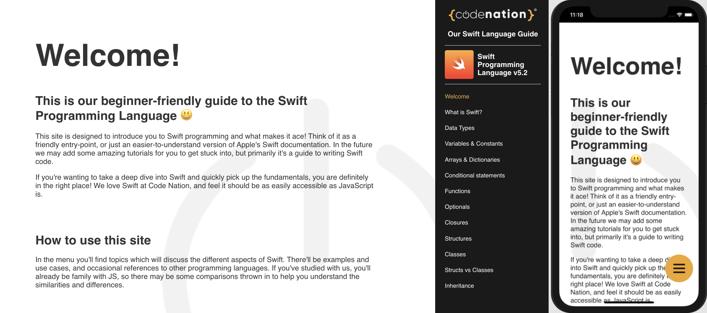

### Swift Language Guide v0

Pages on this website/PWA are generated using SSR-React and markdown files.

Site pages found in src/swift

# Contributors
To edit a page:
 - Fork the repo
 - Edit the .md file (either directly on Github or locally)
 - Send a pull request.

To create a new page:
- Fork the repo
- Clone your fork
- Create a .md file in the src/swift directory (please follow the numbering convention)
- Send a pull request.

# Collaborators
If you'd like to be added to this repo as a collaborator so you can avoid all forking then I'm more than happy to do that. Just drop me a message and I'll sort it. 

----------

If you're kind enough to add to this project please familiarise yourself with markdown syntax.
